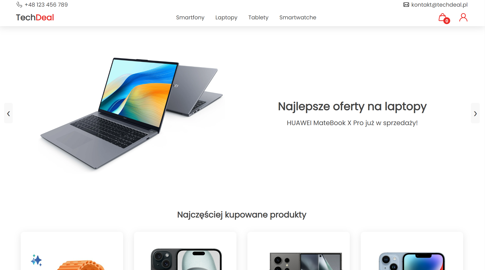
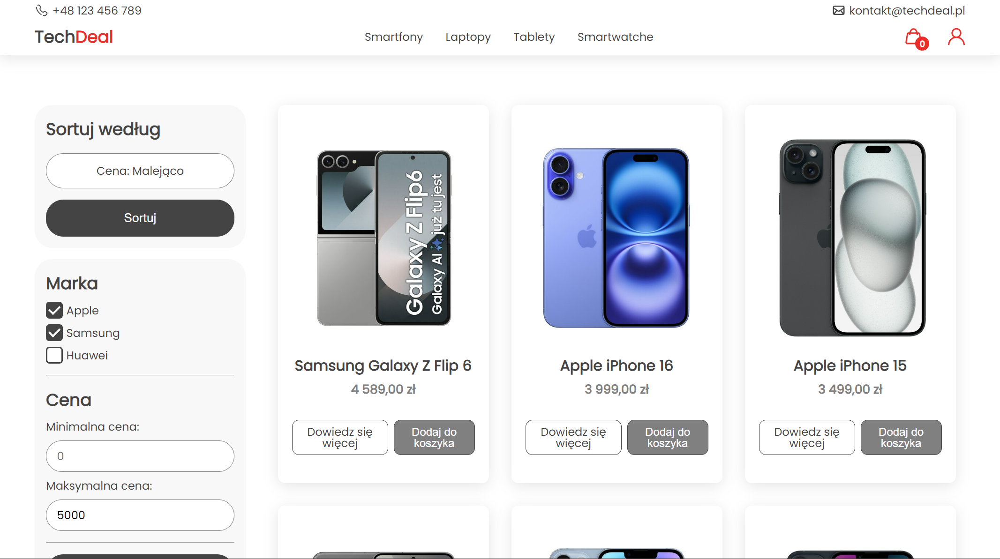
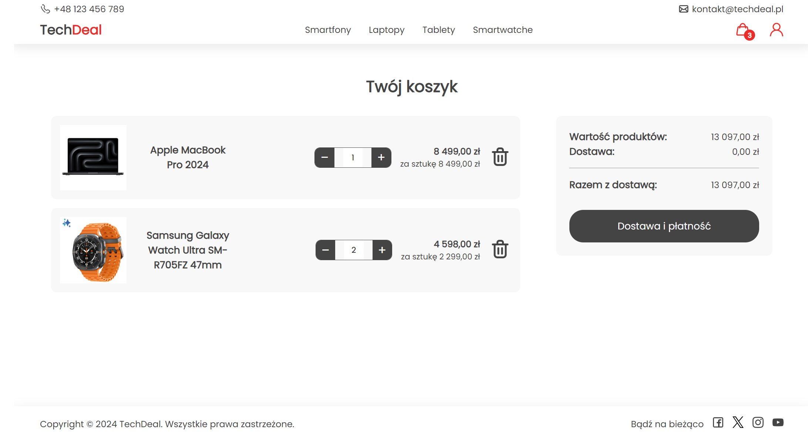
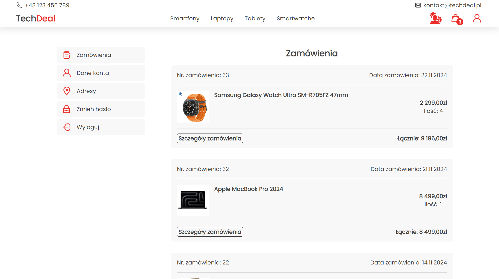
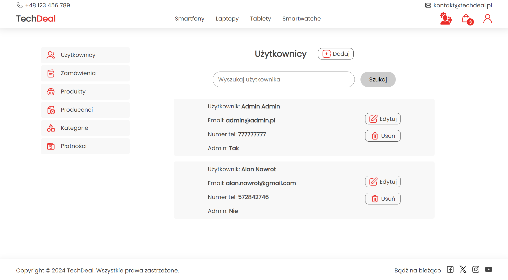

# TechDeal

**TechDeal** is an online store specializing in electronics such as smartphones, tablets, laptops, and smartwatches. The project was built using HTML, CSS, PHP, JavaScript, and MySQL.

### Features:
- **User Authentication:** Secure registration and login system with encrypted passwords and session management.
- **Shopping Cart:** Add products to the cart, update quantities, and review orders before checkout.
- **Order Management:** Place orders and review order history.
- **Admin Panel:** Manage products, categories, users, and orders efficiently.
- **Filters and Sorting:** Browse products by brand and price range.
- **Dynamic Content:** Products, categories, and user-specific data are dynamically fetched from the database.
- **Responsive Design:** Optimized for both desktop and mobile devices.
- **And more...**

### Security:
The project prioritizes security with the following measures:
- **SQL Injection Protection:** All database queries are prepared statements.
- **Cross-Site Scripting (XSS) Protection:** Input sanitization ensures safe user data.
- **Cross-Site Request Forgery (CSRF) Protection:** Tokens secure forms and critical actions.

### Validation:
- **Client-side Validation:** JavaScript ensures immediate feedback on form inputs.
- **Server-side Validation:** PHP validates data before storing it in the database.

### Technology Stack:
- **Frontend:** HTML, CSS, JavaScript
- **Backend:** PHP
- **Database:** MySQL

### Screenshots
Here are some example screenshots of the TechDeal application:

